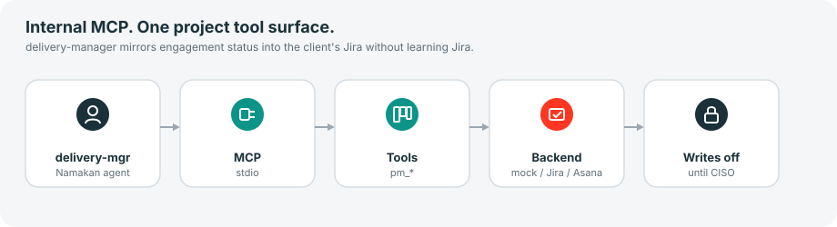
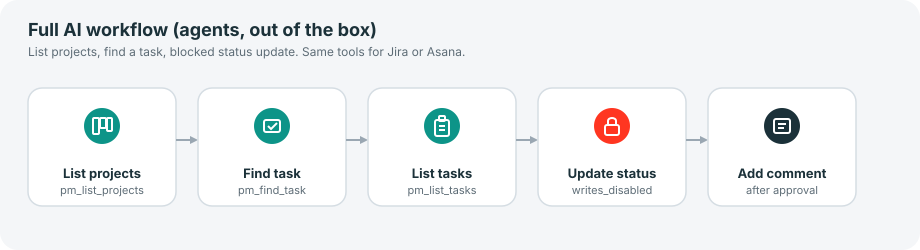
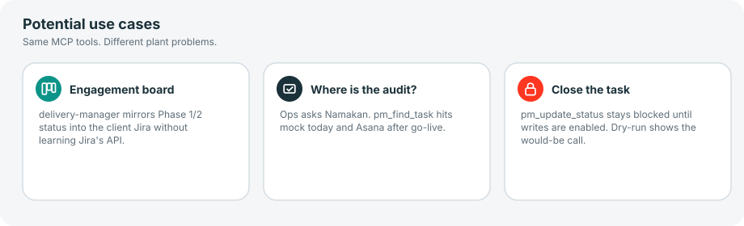

# namakan-mcp-projects

Internal MCP server: one project/work-management surface. Namakan agents call `pm_find_task` whether the backend is Jira, Asana, Monday, ClickUp, Smartsheet, Microsoft Project, or Trello.

`delivery-manager` uses the same tools to project engagement status into the client's board. The client PMO does not configure MCP.

## How agents connect

```yaml
mcp_servers:
  namakan-mcp-projects:
    command: uvx
    args:
      - --from
      - git+https://github.com/cfollette18/namakan-mcp-projects.git
      - namakan-mcp-projects
      - serve
    env:
      NAMAKAN_PM_BACKEND: mock
    trust: full
```

Bootstrap writes that into every Hermes profile with `using-namakan-mcp`.

## Architecture



## Full AI workflow



1. `president-coo` assigns delivery tracking to `delivery-manager`.
2. Agent calls `pm_run_workflow` (list → find → blocked status update).
3. Writes stay off until `ciso` approval. Dry-run shows the would-be call.

Demo without an agent process:

```bash
namakan-mcp-projects workflow
```

Expected: four JSON steps. Last step `"error": "writes_disabled"`.

## Tools

| Tool | Access | Arguments |
|---|---|---|
| `pm_find_task` | read | `query` |
| `pm_list_tasks` | read | `project_id?` |
| `pm_list_projects` | read | — |
| `pm_update_status` | write | `task_id`, `status` |
| `pm_add_comment` | write | `task_id`, `body` |
| `pm_run_workflow` | read + blocked write | `use_case?`, `query?` |

Mock statuses: `todo`, `doing`, `blocked`, `done`. Map vendor states in the adapter, not in the tool name.

## Potential use cases



| Use case | Which agent | Why it matters |
|---|---|---|
| Engagement board | `delivery-manager` | Mirror Phase 1/2 status into the client's Jira without learning Jira's API. |
| Where is the audit? | `delivery-manager` | Mock today, Asana after go-live. Same tool. |
| Close the task | `ciso` gates the write | Blocked until writes are enabled. |

`use_case`: `engagement-board` (default), `where-is-the-audit`, `close-the-task`.

## Tests

```bash
pip install -e ".[dev]"
pytest
```

## License

MIT. Copyright (c) 2026 Namakan AI Engineering.
