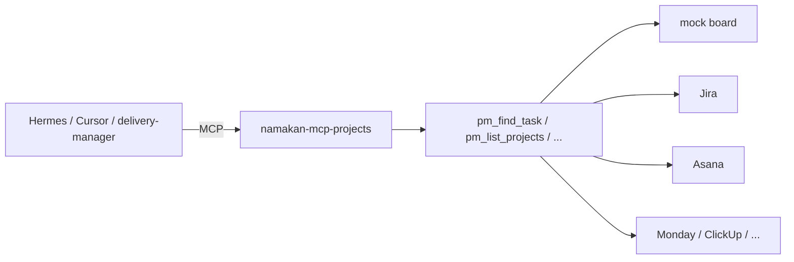

# namakan-mcp-projects

One MCP server for **project and work management**. Agents call `pm_find_task` / `pm_list_projects` whether the backend is Jira, Asana, Monday, ClickUp, Smartsheet, Microsoft Project, or Trello.

Namakan's own `delivery-manager` can use the same tools to project engagement status into a client's system.

Mock data ships in the package. No Jira token required to try it.

## Run in 60 seconds

```bash
pip install git+https://github.com/cfollette18/namakan-mcp-projects.git
namakan-mcp-projects demo
namakan-mcp-projects call pm_find_task query=audit
namakan-mcp-projects call pm_list_projects
```

`demo` lists projects, finds a task, then shows the **writes-disabled** error when it tries to mark a task done.

## How it fits



## Wire it into Cursor

```json
{
  "mcpServers": {
    "namakan-projects": {
      "command": "namakan-mcp-projects",
      "args": ["serve"],
      "env": {
        "NAMAKAN_PM_BACKEND": "mock"
      }
    }
  }
}
```

Persist mock writes (after you enable them) with `NAMAKAN_PM_STORE=/tmp/pm.json`.

## CLI

| Command | What it does |
|---|---|
| `namakan-mcp-projects` / `serve` | MCP stdio |
| `tools` | List unified tools |
| `call TOOL k=v` | Invoke without an MCP host |
| `demo` | List + find + writes-disabled |

## Tools

| Tool | Access | Arguments |
|---|---|---|
| `pm_find_task` | read | `query` |
| `pm_list_tasks` | read | `project_id?` |
| `pm_list_projects` | read | — |
| `pm_update_status` | write | `task_id`, `status` |
| `pm_add_comment` | write | `task_id`, `body` |

Status values the mock understands: `todo`, `doing`, `blocked`, `done`. Map vendor-specific states in the vendor adapter, not in the tool name.

## Writes

```bash
NAMAKAN_MCP_ALLOW_WRITES=1 NAMAKAN_MCP_DRY_RUN=1 \
  namakan-mcp-projects call pm_update_status task_id=t1 status=done
```

## License

MIT. Copyright (c) 2026 Namakan AI Engineering.
